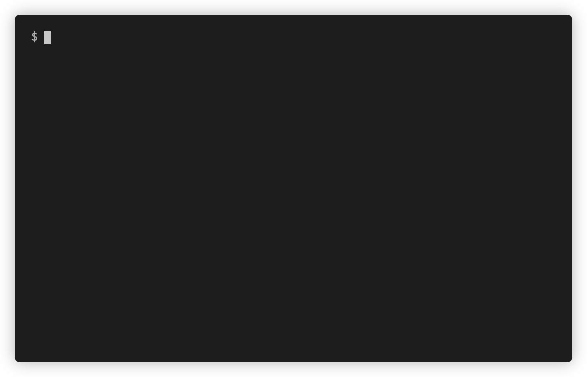

<p align="center">
    <p align="center">
        <a href="https://github.com/mortenscheel/task-flow/actions"></a>
        <a href="https://packagist.org/packages/mortenscheel/task-flow"></a>
        <a href="https://packagist.org/packages/mortenscheel/task-flow"></a>
        <a href="https://packagist.org/packages/mortenscheel/task-flow"></a>
    </p>
</p>

# Task Flow
Build dynamic nested console workflows with ease.

## Installation
You can install the package via composer:

```bash
composer require mortenscheel/task-flow
```

## Getting started

### Example flow


### Laravel example
```php
use Scheel\TaskFlow\Context;
use Scheel\TaskFlow\Facades\TaskFlow;
use Scheel\TaskFlow\Task;

TaskFlow::run([
    Task::make('Closure', function (Context $context) {
        // Do stuff
        usleep(500000);
        // Set context data for future tasks
        $context->set('foo', true);
    }),
    Task::make('Conditional', function (Context $context) {
        // Read context data from previous tasks
        if ($context->get('foo')) {
            // Skip current task, including child tasks
            $context->skip();
        }
    }),

    // Task action can be an invokable class
    Task::make('Invokable', new SomeInvokable),
    Task::make('Nested tasks', children: [
        Task::make('Subtask 1', $this->classMethod(...)),
        Task::make('Subtask 2', children: [
            Task::make('Subtask 2.1', children: [
                Task::make('Subtask 2.1.1', fn () => sleep(1)),
                Task::make('Subtask 2.1.2', fn () => sleep(1)),
            ]),
            Task::make('Subtask 2.2', fn () => sleep(1)),
        ]),
    ]),
    Task::make('Final task', fn () => sleep(1)),
]);
```
### Standalone example
```php
use Scheel\TaskFlow\Renderer\ConsoleRenderer;
use Scheel\TaskFlow\Task;
use Scheel\TaskFlow\TaskManager;
use Symfony\Component\Console\Output\ConsoleOutput;

// The TaskManager has to be constructed manually
$manager = new TaskManager(new ConsoleRenderer(new ConsoleOutput()));
// But the rest of the API is the same, whether you use Laravel or not
$manager->run([
    Task::make('Task 1', fn (): null => null),
    Task::make('Task 2', children: [
        Task::make('Task 2.1', fn (): null => null),
        Task::make('Task 2.2', children: [
            Task::make('Task 2.2.1', fn () => fn(): null => null),
        ]),
    ]),
    Task::make('Task 3', fn (): null => null),
]);
```

## Configuration
The default configuration is as follows:
```php
[
    'indent' => 2,
    'symbols' => [
        'pending' => '…',
        'running' => '▶',
        'completed' => '✓',
        'skipped' => '⏭',
        'failed' => '✗',
    ],
    'colors' => [
        'pending' => 'gray',
        'running' => 'bright-white',
        'completed' => 'green',
        'skipped' => 'yellow',
        'failed' => 'red',
    ],
]
```
### Laravel
You can publish the config file with:
```bash
php artisan vendor:publish --provider="Scheel\TaskFlow\TaskFlowServiceProvider" --tag="config"
```
### Standalone
You can pass a custom configuration array to the `ConsoleRenderer` constructor:
```php
$manager = new TaskManager(new ConsoleRenderer(new ConsoleOutput(), [
    'symbols' => [
        'pending' => '💤',
        'running' => '🏃‍♂️️',
        'completed' => '🎉',
        'failed' => '😭',
        'skipped' => '⏩',
    ]
]));
```

## Task Context
The `Context` is a shared object, which is passed to all task actions.
- `set(string $key, mixed $value): void` - Set a value in the context for use by future tasks.
- `get(string $key): mixed` - Get a value from the context, provided by previous tasks.
- `has(string $key): bool` - Check if a key exists in the context.
- `increment(string $key, int $amount = 1): void` - Increment a value in the context.
- `skip(): void` - Skip the current task, including all child tasks.
- `updateTitle(string $title): void` - Update the title of the current task.
- `abort(): void` - Abort the entire task flow. This has the same effect as throwing an exception.
- `interactive(callable $callback): mixed` - Allows for user interaction, without interfering with the task flow status output.

